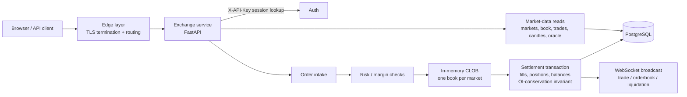

The Atlas exchange is deliberately a **monolith**: one Python FastAPI application
(`server_v2.py`, a single module of roughly five-to-six thousand lines) contains
every route, every background loop, and the static frontend server. A small ring of
satellite modules holds the pieces that benefit from being pure and independently
testable (matching arithmetic, risk checks, basket math, the settlement-rail
client). State lives in PostgreSQL via an asyncpg pool; the frontend is static
no-build HTML/JS served by the same app.

Each environment (production, staging, dev) runs its own instance of this same
application against its own database. The staging build carries newer oracle-layer
additions (the "v3" features) that have not yet been promoted to production.

:::note[One process, many subsystems]

"Monolith" here is an architectural fact, not an accident: a single process owns
the order books, the risk marks, the WebSocket fan-out, and the settlement path,
which keeps the matching-to-settlement flow in one transaction boundary. Durable
state — orders, trades, positions, balances, and halts — lives in the database,
so a restart **rehydrates** the in-memory books from it rather than losing them.

:::
---

## Module and subsystem map

| Subsystem | Code | Role |
|---|---|---|
| App core & routing | `server_v2.py` | FastAPI app, all HTTP/WS routes, static file serving, SPA catch-all, CORS, rate limiting |
| Auth & identity | `server_v2.py` + `withdraw_auth.py` | Email signup/login (bcrypt), wallet/signature login and challenge, session tokens (`X-API-Key`), recovery phrases, withdraw signature auth. Legacy unauthenticated signup/login routes are retired (HTTP 410) |
| Markets & indices | `ai_basket.py`, `battery_basket.py`, `ree_basket.py` (`china_basket.py` retired) | Index/basket level computation for the three composite markets |
| Oracle consumer | `oracle_guard.py` | Staleness / clamp / halt state machine over the external oracle blend; falls back to the v1 scrape when the blend is missing or stale; persisted halts |
| Orders & CLOB | `clob_engine.py`, `matching_core.py` | Full price-time-priority CLOB matching engine per market — FIFO within a price level, LIMIT/MARKET orders, partial fills, post-only, reduce-only, self-trade prevention, deterministic ordering; pure fill arithmetic (`apply_fill`, `compute_liquidation_price`) kept free of I/O |
| Positions, margin, liquidation | `risk_engine.py` + monolith tasks | Margin checks, authoritative margin recompute, risk-mark updates, stop triggers, liquidation monitor |
| Market-making book | `vault_mm.py` | The VaultMM market maker that posts the real CLOB quotes for every market |
| Settlement-rail client | `canton_client.py`, `canton_commands.py`, `canton_shadow.py` | Distributed-ledger settlement-rail client with a durable holdings mirror — real command/settlement code, **integrated but under controlled activation** (fail-closed, not actively settling in production today; activation is a [roadmap](/roadmap/) item). See the settlement-rail page |
| Growth | in `server_v2.py` | Leaderboard, rewards/points, referrals, notifications, portfolio history (see the growth & sim page) |
| Simulated flow | in `server_v2.py` | Built-in simulated trader flow and a sim-clock speed knob (see the growth & sim page) |
| WebSocket | `/ws` in `server_v2.py` | Live trade / orderbook / liquidation channels |
| Intelligence feed | `news_scraper.py` | News ingest behind `/v4/intelligence/feed` |
| DB access | `db.py` | asyncpg pool helper; schema managed by manually-applied SQL migrations (there is **no** migration-ledger table) |

---

## Request flow

Public market-data routes are unauthenticated; account and trading routes require a
session token in the `X-API-Key` header. All routes are versioned under `/v4`, with
legacy unversioned aliases kept for compatibility (see the API reference).

## The trading flow, end to end

1. **Order intake** — validation, rate limit, margin reservation.
2. **CLOB match** — the order crosses the in-memory book for its market.
3. **Settlement** — fills route through a single settlement path
   (`clob_settle` → the trade-settlement transaction) that updates positions,
   balances, and open interest together, guarded by a per-market
   **net-OI-must-equal-zero** invariant with a drift alarm.
4. **Risk mark** — mark prices update; margin is recomputed authoritatively rather
   than trusted from the order path.
5. **Funding** — a periodic funding tick with an hourly settle, a clamp on the
   funding rate, and derivation of the perp-implied "Atlas Spot" reference.
   Settlement mechanics run today: longs pay shorts against a per-account
   ledger. The funding *design* today is a point-in-time damped mark-vs-reference
   premium — carry-adjustment and time-weighting (TWAP) are roadmap items.
6. **Liquidation** — the liquidation monitor force-closes positions that breach
   maintenance margin, emitting WebSocket liquidation events and notifications.

:::note[The matching engine is real; the liquidity is a test environment]

The CLOB is a genuine, full-featured price-time-priority matching engine — not a
synthetic or shortcut fill path. What is house-provided today is the book's
*liquidity and depth*: quotes come from the built-in VaultMM market maker and
simulated trader flow rather than third-party participants, so the ten markets
run as a **test environment**. The matching, settlement, margin, and liquidation
paths that process that flow are the production mechanics.

:::

:::note[Funding design — planned depth]

Carry-adjusted reference pricing (spot adjusted for storage/financing) and
TWAP funding over the interval are planned; see [Roadmap](/roadmap/). Today's
funding is a single damped-premium regime applied uniformly.

:::

---

## Lifespan: startup and background tasks

### Startup restore

On boot the service rebuilds its in-memory world from durable state:

- open resting orders are reloaded from the `orders` table into the CLOB books
  (`clob_reload_open_orders`);
- mark prices are restored from the latest spot snapshots;
- **persisted halts are reloaded** — oracle circuit-breaker halts and
  settlement-rail halt state survive restarts by design;
- the settlement rail validates its auth secret and **fails closed** (rail off,
  app up) — the distributed-ledger rail is integrated but stays under controlled
  activation, so custody operations are disabled in production today while
  everything else runs (activation is a [roadmap](/roadmap/) item).

### Background task set

Registered in the FastAPI lifespan (the staging build adds the last two):

| Task | Purpose |
|---|---|
| `oracle_scraper` | Consume/refresh reference prices; compute index levels |
| `vault_market_maker` | Run the VaultMM quoting loop |
| `funding_updater` | Funding tick + hourly settle; Atlas Spot derivation |
| `risk_mark_updater` | Refresh risk marks |
| `oi_invariant_monitor` | Watch the net-OI conservation invariant |
| `liquidation_monitor` | Detect and execute liquidations |
| `stop_trigger_monitor` | Trigger resting STOP orders |
| `snapshot_retention` / `partition_maintenance` | Prune snapshots; maintain monthly trade/candle partitions |
| `maps_sweep` | Periodic in-memory map hygiene |
| `user_sim_runner` | Simulated trader flow (see growth & sim) |
| `data_delay_refresher` | Maintain the delayed public oracle view |
| `equity_snapshotter` | Account equity time series (portfolio history, leaderboard PnL) |
| `points_accrual` | Rewards points accrual |
| `market_maker_random_walk` *(conditional)* | Legacy random-walk MM, off by default |
| `canton_reconciliation_checker` *(conditional)* | Rail balance reconciliation |
| `soak_shock_injector` *(staging only)* | Soak-test shock injection |
| `v3_oracle_refresher` *(staging only)* | Oracle v3 layer refresh |

:::note[Environment flags]

Behavior toggles are environment variables (names only, never values):
`ATLAS_ORACLE_V2`, `ATLAS_V2_MAX_STALENESS`, `ATLAS_RANDOM_WALK_MM`,
`ATLAS_ALLOW_LOCALHOST_CORS`, `ATLAS_FUNDING_INTERVAL`, `ATLAS_DATA_DELAY`,
`ATLAS_DATA_LICENSE_KEYS`, `ATLAS_VAULT_APY_MODE`, `ATLAS_INV_RISK`, plus the
sim knobs covered in the growth & sim page. Defaults apply when unset.

:::
