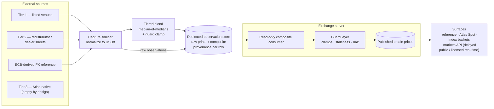

The Atlas oracle produces the **reference price** for every listed market: a
manipulation-resistant, externally anchored USD price per mineral, refreshed
roughly once a minute. It is the input to funding, liquidations, risk marks, the
index baskets, and the licensed data product — so its design goal is simple to
state: *no single source, venue, or participant should be able to move it.*

This page describes what the oracle does **today, in production**. Where a
mechanism is designed but not yet live, it is called out and linked to the
[roadmap](/roadmap/).

## Two-part design

The oracle is deliberately **not** one service. It is split into a capture side
and a consumption side, joined only by a database:

1. **Capture sidecar** — a standalone, separately supervised process. It polls
   every external source on its own cadence, normalizes every print to
   **USD per tonne**, and writes raw observations plus a blended composite into
   a **dedicated observation store** isolated from the exchange's own data. The
   sidecar is a pure producer.
2. **Read-only consumer inside the exchange** — the exchange server reads the
   freshest composite rows from the observation store, passes them through its
   own **guard layer**, and only then publishes them as the live oracle price.
   The exchange never writes to the observation store.

This split means a scraping bug, a source outage, or a sidecar crash cannot
take the exchange down — and because the exchange only ever reads the
observation store, the oracle's audit trail cannot be contaminated by the venue
it feeds.

## The tiered source hierarchy

Sources are classed by *what kind of truth they carry*, and the blend combines
them by **median** (never a mean), so a single manipulated or stale print
cannot drag the rate.

The full design is a five-tier hierarchy. **Today, only three input types
actually flow into rate formation:** listed-venue reference prints, a
market-data redistributor, and dealer-sheet quotes. The remaining tiers are
part of the target architecture and are tracked on the [roadmap](/roadmap/).

| Tier | Class | Role in the blend | Status |
|---|---|---|---|
| 1 | Listed venues | Primary anchors — listed reference prints for the liquid metals | **Live** |
| 2 | Market-data redistributor / dealer sheets | Coverage for minerals with no listed venue; down-weighted for the liquid metals | **Live** |
| 3 | Atlas-native market data | **Deliberately empty.** Feeding the venue's own prices back into its oracle would be self-referential; this tier stays empty by design | **Live (empty by design)** |
| 4 | Physical-trade surveillance | Implied unit values from customs/trade statistics — a lagged sanity *band*, never a tick | Roadmap |
| 5 | Fundamentals and sovereign data | Government survey prices as a slow reference band | Roadmap |

An **ECB-derived FX reference feed** is captured live for currency
normalization; it converts non-USD prints to USD but is not itself a
price-forming input.

:::note[Planned input classes]

Price-reporting-agency (PRA) feeds, transaction/OTC observations, and sovereign
data are designed but **not ingested today**. Physical-trade surveillance is
captured for reference but does not enter the tick. These are tracked on the
[roadmap](/roadmap/).

:::

Within a tier, sources are combined by **equal-weight median**; across tiers,
the tier composites are combined by a **liquidity-weighted median** — a
median-of-medians. The result is stored as its own composite series alongside
the raw observations, with provenance metadata per row, and is then clamped by
a guard before it is ever served.

:::caution[Licensed methodology]

The identity of the individual sources and the per-source weights are part
of Atlas's licensed data methodology and are documented only on internal
pages. This page intentionally describes the *shape* of the hierarchy, not
its contents.

:::

## Guard layer

Before the composite is published, the exchange runs it through a guard:

- **per-update clamp** — max 1% move per tick,
- **daily clamp** — max 10× cumulative move vs start-of-day,
- **staleness detection** — a wall-clock freshness window per market, surfaced
  as an explicit `STALE` state,
- **saturation halt** — after repeated same-direction clamps the market
  `HALT`s, with automatic clearance after a run of clean updates,
- **one-time re-anchor** — so a *validated* level shift at cutover does not
  grind through the tick clamp into a false halt.

### Liveness readout

Each market carries one published liveness state, visible on the public health
endpoint. Today the guard publishes a **three-state** readout:

| State | Meaning |
|---|---|
| `FRESH` | The reference is inside its freshness window and passing the guard. |
| `STALE` | The composite has aged past its per-market window; the last value is held. |
| `HALTED` | A guard breach (saturation) froze the reference; auto-clears after a run of clean ticks or by oversight. |

:::note[Planned: graduated liveness states and bands]

A richer state machine — distinguishing venue-anchored from composite-anchored
liveness, PRA-banded operation, and calendar-aware holds, each with graduated
deviation bands and per-state funding behavior — is designed but **not live**.
Today the readout is `FRESH`/`STALE`/`HALTED` only. See the
[roadmap](/roadmap/).

:::

## The mineral/market registry

A single canonical registry defines the mineral universe (17 minerals),
their unit conversions to USD/tonne, and the mapping from minerals to tradable
markets. Two doctrine points worth knowing:

- **One mineral, one spec.** "Lithium" always means carbonate basis across
  every source; hydroxide is tracked as a separate series and never blended in.
- **Markets vs minerals.** The blend is computed in USD/tonne; per-market
  divisors convert to each market's native quote unit at publish time. The
  public surface serves the tradable single-metal markets plus composite index
  markets derived from constituents.

Regional spec spreads (for example, an onshore-vs-offshore premium) are treated
as *signal* rather than error to be averaged away. Surfacing an explicit
China-onshore premium as its own field is designed but **not live today** — see
the [roadmap](/roadmap/).

## Index baskets

Composite index markets are **identity-constructed** from their constituents:

$$
L = \text{BASE} \cdot \sum_i w_i \frac{P_i}{P_{i,0}}
$$

The served indices — the battery-metals basket and the AI-minerals basket —
carry fixed constituent weights and are **fail-closed**: if any constituent leg
is missing, the index does not print rather than printing a partial value.
Rare-earth legs that have no tradable Atlas market are priced from dealer-sheet
quotes and enter the basket the same way.

:::note[Planned: continuous identity enforcement]

Per-cycle recomputation from constituents with a continuously *enforced*
identity check is running in the next-generation pipeline but is **not yet
promoted to production**; the production health endpoint currently *reports* a
served-vs-implied identity gap rather than enforcing it to zero. See the
[roadmap](/roadmap/).

:::

## Reference, mark, and Atlas Spot

Three prices exist per market, and keeping them distinct is the core of the
pricing thesis:

- **Reference** — the oracle output described above: the external,
  multi-source anchor.
- **Mark** — where the perpetual actually trades on the venue (order-book
  driven). Funding continuously pulls the mark toward the reference.
- **Atlas Spot** — the **perp-implied spot price**: the spot level implied by
  where the perpetual market trades and the funding basis, published per
  market alongside the reference and derived one-way from the mark and
  reference (never fed back into rate formation).

The directional thesis — that over time the *market-implied* price, rather than
any single reported assessment, becomes the primary signal, with slow-moving
physical-trade surveillance as the sanity check — depends on input classes that
are still on the [roadmap](/roadmap/). Today, Reference and Atlas Spot are both
live and together form the licensed data product (see
[Data licensing](/oracle/data-licensing/)); the mark and all trading data
remain freely available in real time.

## Anti-circularity

The oracle is structurally prevented from consuming Atlas's own market data.
The capture sidecar captures **no** Atlas-native prints; the blend policy admits
only external sources; and Atlas Spot is derived one-way from the mark and
reference and is never written back into the observation store. Tier 3 stays
empty by design.

## Data flow

## Where to go next

- [Data licensing](/oracle/data-licensing/) — the delayed-vs-licensed serving model.
- [Atlas Spot & the perp-implied thesis](/exchange/overview/) — how reference prices
  meet the venue's own mark and funding.
- [Roadmap](/roadmap/) — planned input classes, graduated liveness states, and
  continuous identity enforcement.
