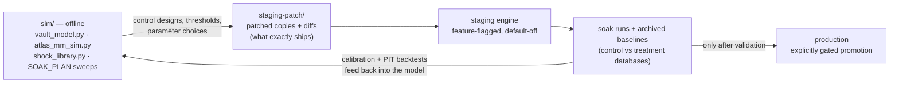

The `sim/` directory in the repo is the **offline quant laboratory** for the
market-making book: pure,
reproducible Python that models the book, stress-tests it against a
calibrated shock library, and sizes the risk controls — *before* anything is
deployed to staging. Nothing in `sim/` touches a live system; it is the first stage
of a deliberate offline → staging → production pipeline. The harness feeds staged
rollouts — the staging-soak and production-promotion stages of that pipeline are
tracked as roadmap validation work (see the [Roadmap](/roadmap/)).

## Inventory

| File | Role |
|---|---|
| `vault_model.py` (+ `test_vault_model.py`) | the pure Monte-Carlo risk core (numpy-only, importable, seed-reproducible) with property/regression tests |
| `atlas_mm_sim.py` | Stage A offline MM harness — imports the *real* matching engine and ports the real quoting formulas, then drives realistic taker cohorts against them |
| `vault_risk_sim.py` | unified risk Monte-Carlo used by the SOAK_PLAN parameter sweeps (S1–S6) |
| `portfolio_margin_sim.py` | isolated-vs-portfolio margin efficiency study |
| `shock_library.py` | 32 real-world-calibrated shock scenarios (3 severity bands, 10 event types) |
| `SOAK_PLAN.md`, `RESULTS.md`, `STRESS_RESULTS.md`, `SHOCK_RESEARCH.md`, `ADVERSARY_RESULTS.md`, `RED_TEAM_BRIEFING.md` | the written findings the code produced |
| `staging-patch/` | patched copies + diffs of exactly what was later deployed to staging — the de-facto version control for staged changes |

## Stage A — the offline MM harness

`atlas_mm_sim.py` reuses the production matching engine and the production quoting
formulas, then replaces the live flow with **realistic cohorts**: retail noise
traders, toxic momentum-followers, and competing external market makers — with no
helpful steering of any kind. Its purpose is to answer "what does this book earn
under honest conditions?" before staging ever runs.

Its structural findings: the target carry is reachable
only at **mature volume with limited competition**; realistic early-stage
conditions (low volume, several competitors) earn far less; and an uncontested
benign-flow book earns far *more* than a competitive one — the book's economics
are dominated by volume and competition, not by any single quoting parameter.

:::note[Known caveat]

The Stage A harness holds the oracle price flat, so tail outcomes and
cumulative-loss probabilities are **understated** there. Tail risk is the job of
`vault_model.py` and the shock library below.

:::
## `vault_model.py` — the pure quant core

Built after a multi-agent review graded the previous dashboard model C− and iterated
it to A−/B+ over eight review rounds. Design principles:

**1. P&L decomposition — net capture is an *output*, never an input:**

```text
net = fee_capture + funding_carry − adverse_selection − inventory_carry
```

Adverse selection scales with realized vol and is **convex in intraday volume
spikes** — high-volume days are loss days, and net can go negative. Both behaviors
are pinned by tests.

**2. Path-based daily-grid Monte-Carlo:**

- heavy-tailed returns (Student-t, df = 3) with clustered shocks
  (regime-switching intensity ×4);
- correlated battery-sector crashes (battery crash magnitude 0.55);
- stochastic volume (OU process) *correlated with* shocks;
- structural inventory skew — the book ends up net short the crowded
  battery/index "story" minerals;
- loss-reserve accrual and depletion;
- a **cumulative-loss** event modeled with a severity ladder
  (1.00 / 0.99 / 0.95 / 0.90).

**3. Uncertainty is the product, not a footnote:**

- seed-varied ensembles → P5/P50/P95 fans;
- Wilson intervals on P(cumulative-loss breach); cluster-bootstrap CIs;
- Sharpe / Sortino / Calmar / VaR / CVaR / drawdown metrics;
- calibration + PIT/coverage backtests against the live soak database.

Headline defaults at a $1M seed: net capture ~3.6 bps dollar-weighted;
a cumulative-loss breach ~12%/yr, but severity below 0.90 only ~1.5%. Parameters
double as a map
of the risk surface: `fee_bps = 7.5` gross, `adverse_k = 0.45`,
`spread_floor = 0.006`, `retain_days = 15`, `base_buf = 0.03`,
`shock_lambda = 24/yr`, `crash_p = 0.003/day`, with position caps treated as a
capacity bound (fixed at launch, so more capital mechanically lowers risk — a
self-correcting dynamic).

## SOAK_PLAN — the four multiplicative controls

Phase-1 Monte-Carlo sweeps (S1–S6, `vault_risk_sim.py`) searched for a launch
configuration and found a sharp interaction: **dropping any one control pushes
the cumulative-loss breach rate to ~90–100%/yr; all four together push it to ~0%.**
They multiply — none is optional.

| # | Control | Status |
|---|---|---|
| 1 | **Liquidity-adaptive spread floor** — wide-when-thin; "tight + thin" is the only unsafe combination | **Deployed** to the staging engine (behind a flag) |
| 2 | **Risk-based per-market caps** — an 8%-of-capital loss budget divided by stress vol | Not yet built as designed; a partial notional backstop exists behind a flag |
| 3 | **Rolling retention buffer** — ≥ 15 days of revenue held as a loss-absorption reserve | Not yet built; the current buffer is not revenue-retention |
| 4 | **Portfolio/netting margin** for the market-making book | Not built; sized by `portfolio_margin_sim.py` — ~3x capital efficiency in balanced operation but only ~1.5x in a correlated crash, so solvency must be sized to the 1.5x case |

## The shock library

`shock_library.py` encodes 32 shocks calibrated to real critical-minerals events,
in three severity bands across 10 event types. Stress results:

- **27 of 32 scenarios survive** without a cumulative-loss breach;
- **all 5 breaches are battery metals** — worst case a cobalt +167%
  supply shock (DRC-style) driving a −29% book drawdown;
- **baskets beat their worst constituent** — index diversification works as
  designed;
- residual risk is therefore the **battery tail**: roughly a 1-in-8-to-16-year
  transient −20%…−37% dip, historically recovered in weeks.

## How offline calibration feeds staged rollouts



The working rhythm: a control is designed and sized offline (SOAK_PLAN sweeps, the
shock library), lands in `staging-patch/` as an explicit diff, deploys to staging
**behind a default-off flag**, is soaked with archived control/treatment databases,
and only then becomes a candidate for production. The model is honest in both
directions — live soak data feeds calibration and coverage backtests *back into*
`vault_model.py`, so the offline core stays anchored to observed behavior.

:::note[Open gap]

Controls #2–#4 from SOAK_PLAN (risk-based caps, revenue-retention buffer,
portfolio margin) exist only in the offline layer. Given the sweeps' finding
that the controls are multiplicative, the launch gate should treat building
them as blocking work, not hardening polish. **Unblock path:** implement each
behind a default-off flag, then validate with the same control/treatment soak
pattern used for the concentration overlay.

:::
