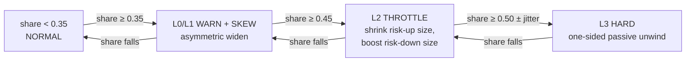

A portfolio-level concentration control designed for the vault's market-making
book. It is deliberately a **risk overlay, not a strategy**: it is passive, never
forecasts price, and never crosses the spread. This page describes **how the
control works** by design.

:::note[Staging validation — not yet in the production build]

The concentration overlay is a designed control that is currently **armed on the
staging soak**, where it runs with ladder defaults to bleed down existing
concentration. It is **not part of the production build** — the code default
remains off, and production does not carry the overlay. It is slated for
production once validated. See the [Roadmap](/roadmap/) for promotion status.

:::

## The gap it closes

Every pre-existing control — inventory tiers, quote skew, the one-sided cutoff —
measures a market's inventory against **that market's own position cap**. Caps are
sized per-market, so a position can look "normal" on its own axis while dominating
the whole book's risk.

The motivating observation: lithium's cap is 40 units ≈ $960k notional, so a live
~$177k lithium inventory read as *normal* on its own axis — while being **~33% of
the book's total capital-at-risk**. At that point the vault is warehousing mineral
beta, not earning market-making edge. Nothing in the system looked at portfolio
share. This overlay does.

## What it computes

Recomputed off the hot path on the slow refresh cycle (`_recompute_risk()`):

$$
\text{CaR}_m = |\,\text{inv}_m \times \text{mark}_m\,| \times \text{IMR}
\qquad\qquad
\text{share}_m = \frac{\text{CaR}_m}{\sum_k \text{CaR}_k}
$$

- **IMR = 0.10**, *deliberately identical* to the independent measurement pipeline's
  constant — the engine and the monitoring dashboards must agree on the same number,
  or the control argues with its own telemetry.
- CaR here is margin-style capital-at-risk (initial-margin equivalent of the open
  inventory), chosen over a vol-scaled VaR for the control loop because it is
  simple, monotone in exposure, and immune to vol-estimate noise. (A 95%/1-day VaR
  is computed alongside for display only.)
- An optional absolute backstop exists — a per-market notional cap scaled by real
  ADV weight and inverse vol (`cap_notional = SEED × CAP_FRAC × ADV_m / vol_factor`)
  — but defaults off (`CAP_FRAC = 0`).
- Near-flat books are ignored below a $5,000 CaR floor (anti-thrash: with total CaR
  near zero, tiny inventories would otherwise produce huge, meaningless shares).
- Any market at or above the warn threshold logs a structured line naming the
  market, its share, and the active layer.

## The graduated four-level ladder

The ladder acts in the quoting path and the fill-admission gate. Thresholds are on
a market's **share of total portfolio CaR**:

| Layer | Threshold (default) | Action |
|---|---|---|
| **L0 — WARN** | 0.35 | log + dashboard flag only |
| **L1 — SKEW** | 0.35 | widen only the **risk-increasing side**: `+ K_widen (4.0) × base_spread × (share − 0.35)` |
| **L2 — THROTTLE** | 0.45 | cut risk-increasing size: `× max(0.10, 1 − K_throttle (3.0) × (share − 0.45))`; boost risk-reducing size ×1.5 |
| **L3 — HARD** | 0.50 (± 0.02 jitter) — or an absolute-cap breach | drop the risk-increasing side entirely: a **passive one-sided unwind** — incoming flow can then only hit the de-risking side |

Design choices worth defending in review:

- **Graduated, not binary.** A single hard cap creates a cliff: quoting is normal at
  49% and gone at 50%. The ladder degrades the market's economics *continuously* —
  price (L1), then size (L2), then side (L3) — so the book leans against
  concentration long before it must act drastically.
- **Asymmetric by construction.** Every action touches only the risk-increasing
  side. The vault keeps providing liquidity in the direction that heals the book,
  so the overlay never widens the market as a whole.
- **Jittered hard threshold.** The L3 trigger carries ±0.02 random jitter so the
  exact unwind point is not a predictable signal an adversary can lean on.
- **Passive unwind.** Even at L3 the vault only *stops quoting* the bad side. It
  never crosses the spread to force-flatten — an unwind that pays the spread
  converts a concentration problem into a realized-loss problem.
- **Engine/telemetry parity.** Same CaR formula, same IMR as the measurement
  pipeline, so the dashboard's CaR% column is exactly the number the control acts on.

## Why soft guardrails (the empirical rationale)

An overnight baseline read with the overlay **off** (~30 sim-hours) showed:

- lithium at **41.5%** of total CaR, silver at **26%** — concentration absolutely
  emerges on its own;
- but total CaR was only ~$80k on a $5M book (**1.6% utilization**), net markout
  was **+13 bps**, and max drawdown **0.25%**.

Concentration arose **without breaking PnL or markout**. That evidence argues the
guardrails should be *soft* — bend the book's economics against concentration
rather than slam position limits shut on a book that is, so far, being paid fairly
for the inventory it holds. The ladder's thresholds and gains encode exactly that
posture, and the defaults (0.35 / 0.35 / 0.45 / 0.50) leave the observed 41.5% peak
inside L1/L2 territory — shaped, not banned.

## What this is — and isn't

The overlay is a **governance control on notional concentration**, not a portfolio-risk
model. It caps how much of the book's capital-at-risk any single market may represent;
it does not model the *joint* risk of the book.

That distinction matters most exactly where this book is exposed. CaR here sums
per-market `|inv × mark| × IMR` and manages each market's *share* — which treats the
markets as if their risks were separable. They are not: the battery complex (lithium,
cobalt, nickel) and several AI-basket constituents are strongly correlated, so

- a single **joint** drawdown across correlated minerals can arrive without any one
  market crossing its concentration threshold, and
- summing per-market CaR overstates the diversification benefit, while a per-market
  *share* understates true joint exposure.

The target is a covariance-based portfolio-risk layer that replaces the notional sum
with a distributional measure:

$$
\text{VaR}_\alpha,\ \text{ES}_\alpha \;=\; f\!\big(\mathbf{w}^{\top}\boldsymbol{\Sigma}\,\mathbf{w}\big),
\qquad \boldsymbol{\Sigma} = \operatorname{cov}(\text{mineral returns})
$$

with the correlation structure of the battery/AI complex estimated and updated, and
inventory sized to an expected-shortfall budget rather than a per-market notional cap.
Today the 95% / 1-day VaR is computed for **display only**; making it the control
objective (and validating it against a crisis regime) is [roadmap](/roadmap/) work — see
[Model status & validation](/model-status/).

Promotion of the overlay to the production build is tracked on the
[Roadmap](/roadmap/).
