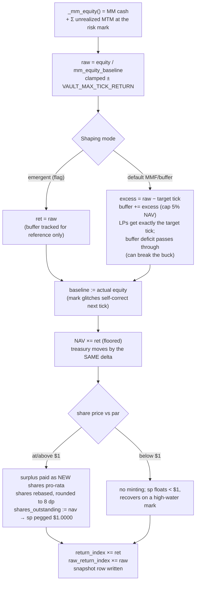

The Atlas Liquidity Vault is a **rebasing money-market-fund (MMF) wrapper** over the
protocol's own market-making book. LPs deposit quote currency and receive shares;
the vault's NAV tracks the *actual* equity of the market-maker account — never a
fabricated accrual. That invariant ("NAV must track real MM P&L") was the central
finding of an internal red-team pass and shapes everything below.

## Data model

Three tables carry the whole state:

| Table | Contents |
|---|---|
| `vaults` | `nav`, `shares_outstanding`, `house_buffer`, `mm_equity_baseline`, `return_index`, `raw_return_index`, `capture_bps`, `treasury_account_id` |
| `vault_shares` | per-account `shares` + `cost_basis` |
| `vault_nav_snapshots` | time series of `nav`, `shares`, `share_price`, `ret_index`, `raw_ret_index` |

`ensure_vault()` idempotently creates the vault and its treasury account, seeded with
a **$5M house seed** (`VAULT_SEED`). The seed is first-loss capital and deliberately
has **no** `vault_shares` row — so `SUM(vault_shares.shares)` ≈
`shares_outstanding − $5M` by design, and depositor count is
`COUNT(vault_shares.shares > 0)`.

## Key constants

```python
VAULT_SEED = 5_000_000.0          # house seed, first-loss, not a share row
VAULT_ACCRUAL_SECONDS = 60.0      # accrual cadence (jittered)
VAULT_NAV_FLOOR = 1.0             # NAV (hence share price) can never reach 0
VAULT_BREAK_BUCK_ALARM = 0.999    # log "prod would halt/socialize" below this sp
VAULT_TARGET_APY = 0.22           # the LP carry while the buffer is funded
VAULT_BUFFER_MAX = 0.05           # buffer cap: 5% of NAV
VAULT_MAX_TICK_RETURN = 0.015     # per-tick move clamp (glitch guard)
VAULT_PAR_TOLERANCE = 0.0005      # 5 bps below-par flag threshold
VAULT_IMPAIRED_SP = 0.95          # deep break-the-buck: hard-pause deposits
VAULT_ACCRUAL_VOL_CAP = 120_000.0 # per-tick volume-sample clamp (spike guard)
```

## NAV accrual loop (`vault_accrual()`, ~60 s cadence)



Step-by-step:

1. **Measure real equity.** `_mm_equity()` = the MM account's cash balance plus the
   sum of unrealized inventory mark-to-market, valued with the **risk mark** (a
   manipulation-resistant mark, not the raw book mid — a red-team hardening fix).
2. **Raw per-tick book RoE.** `raw = equity / mm_equity_baseline`, clamped to
   ±`VAULT_MAX_TICK_RETURN`. This unshaped number is *always* recorded.
3. **Shaping.** Default MMF/buffer model: the excess of raw over the target tick
   accrues to a first-loss **house buffer** (capped at 5% of NAV); LPs receive
   exactly the target tick. If the buffer goes negative, the deficit hits the LP
   return — the vault can genuinely break the buck. (An emergent mode passes `raw`
   straight through instead; see the APY pages.)
4. **Baseline reset.** The equity baseline is set to actual equity every tick, so a
   transient mark glitch self-corrects on the next tick instead of compounding.
5. **Apply.** NAV multiplies by `ret`, floored at `VAULT_NAV_FLOOR`; the treasury
   account moves by the **same applied delta**.
6. **Rebase at par.** At/above par, surplus is paid as *new shares* pro-rata:
   `vault_shares` rebased with 8-decimal rounding (the rounding is itself a fix —
   unbounded NUMERIC scale compounding was a slow-motion perf/DoS), then
   `shares_outstanding := nav`, share price pegged at $1.0000. Below par: no
   minting; the share price floats under $1 and recovers on a high-water mark.
7. **Indices.** `return_index ×= ret` and `raw_return_index ×= raw`; a snapshot row
   is written every tick.

## The $1-pegged share and `return_index`

Because yield is distributed as **more shares** at a $1 peg (classic MMF mechanics),
neither the share price nor raw NAV is an honest return measure — NAV moves with
deposits and withdrawals, and the pegged price hides both gains and drawdowns.

The honest, **deposit-neutral** measure is **`return_index`**: the value of $1
deposited at inception. It compounds only on applied P&L and is immune to flow.
`raw_return_index` is its unshaped sibling (compounding `raw` instead of `ret`),
which is what makes drawdown reporting possible at all — `drawdownPct`/`belowPar`
are computed from the raw index's peak-to-current, since the pegged share price
cannot show a drawdown.

## Deposit rules (`POST /v4/vault/deposit`)

- Authenticated (API key) and rate-limited (30 requests / 60 s).
- **Hard-paused** when share price < `VAULT_IMPAIRED_SP` (0.95) — an impaired vault
  must not accept new LPs.
- Mint at `eff_sp = max(sp, 1.0)` — the **below-par fairness rule**: a depositor
  arriving below par mints at par, donating the sub-par gap to heal the peg. This
  kills the recovery free-ride (buying the dip in a socialized-loss vehicle)
  without the DoS/gaming problems of threshold guards.
- Dust deposits that would mint zero shares are rejected.
- Atomic: user −amount, treasury +amount, `nav += amount`,
  `shares_outstanding += minted`, upsert `vault_shares` (+shares, +cost_basis).

## Withdraw rules (`POST /v4/vault/withdraw`)

- By `shares`, by `amount` (÷ share price), or `all`; burns at the live share price;
  cost basis reduced pro-rata.
- A treasury-balance shortfall is **unreachable** under the invariant below — if it
  ever fires, the vault logs an alarm and refuses. It never fabricates cash.

## Invariants

| Invariant | Why it holds |
|---|---|
| `treasury.balance == vaults.nav` (± rounding) | accrual moves both by the identical applied delta; deposits/withdrawals move both symmetrically |
| NAV tracks real MM equity | accrual reads actual account equity; the baseline resets to measured equity each tick |
| Share price ≥ 0 always; NAV ≥ `VAULT_NAV_FLOOR` | explicit floor |
| At/above par, `shares_outstanding == nav` and sp == $1.0000 | the rebase sets it by construction |
| `return_index` is deposit-neutral | it compounds only applied returns, never flow |
| Withdrawals cannot exceed treasury | consequence of the first invariant; guarded with an alarm-and-refuse path |

The simulated depositor-flow tooling checks `nav == treasury` (±$2) every cycle and
logs the result — an independent, continuous audit of invariant #1.

:::note[Open gap]

The **risk-mark implementation** (`_unrealized_for_positions_risk` /
`_risk_mark_price`) is referenced throughout but its construction is not yet
documented here — it lives elsewhere in the exchange server module. The mark
construction should be folded into this page.

:::
